# fundamentos_python
navia actividad 1 trimestre 6

seccion 1:
lab 1 - "funcion sprint()"

Descripcion:En esta imagen vemos como se usa la funcion "sprint()" para imprimir un hola mundo en la consola y pues yo probe unas cosas extras que funcionan en otros lenguajes y pues es igual, tambien vemos abajo en la consola la ejecucion

lab 2 - "funcion sprint y sus argumentos"

Descripcion:En este laboratorio lo que vemos es que yo trato de replicar la misma estructura que nos pusieron en la actividad y para eso uso los argumentos "end=" y "sep=" para tratar de replicar segun crei que se hacia esa estructura de ejecucion, luego abajo se ve la ejecucion y se pudo segun yo creo, :)

lab 3 - "dando formato de salida"
remplazo con \n

Descripcion: En esta imagen trate de quitar la mayor cantidad de "prints()" usando el argumento "\n" dentro de mismos sprints tratando de replicar la misma estructura de flecha en la ejecucion

flecha mas grande

Descripcion: simplemente puse mas sprints() para hacer la flecha mas grande 

flechas dobles

Descripcion:Aca se muestra como usando un truco de replica explicado en la guia de notion, asi que lo use para replicar la flecha que salga una al lado del otro

eliminar comillas

¿es este el lugar donde realmente existe el error?
R:// en la iamgen se ve que el error que tira la consola, no es donde esta como tal el error, para mi esto demuestra que los errores no son del todo como se ven y que depende mucho de que conozcas el codigo para poder demostrar que esta fuera de lugar porque digamos error no me parece la mejor palabra ya que lo que puede parecer un error puede ser solo otro punto de vista del codigo.

parentesis eliminados

Descripcion: En esta captura lo que se ve es que yo quite algunos parentesis y asu ves las comillas tratando de ver que errores nos da en la terminal 

cambio de mayuscula

¿qué sucede ahora?
R:// lo que se ve en la imagen es que como tal nuestra maquina lo detecta como si fuera una funcion diferente, para dejarlo mas claro me refiero que hay mas funciones o acciones que se pueden derivar cambiando solo una mayuscula o minuscula, por eso nuestra maquina trata de encontrarle una logica a la palabra arrojando posibles resultados

cambio comillas simples

Descripcion: aca solo cambie algunas comillas de por comillas simples o apostrofos mirando que cambiaba y que podria sacar error y pues en la captura se ve que si nos causo algo de problemas pero creo que en parte es porque yo no remplaze todos con las mismas comillas o si directamente en python no se pueden usar comillas simples.

seccion 2:
lab 2 - " Literales de Python - Cadenas"

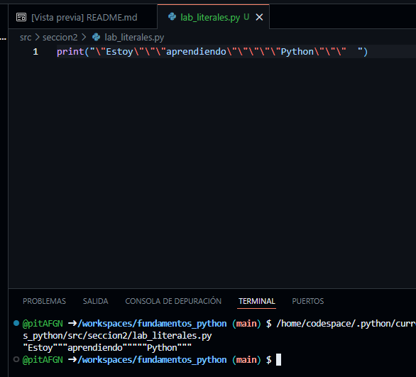

Descripcion: aca solo eh usado los separadores para crear la frase que es solicitada

seccion 3:

Ejercicio 1

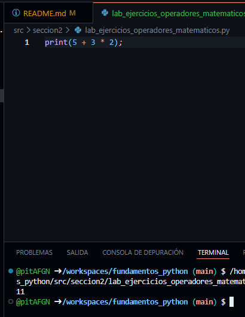

Pregunta: ¿Cuál es el resultado? ¿Por qué?
R://Como se muestra en la imagen el resultado es 11 porque pues se la prioridad a la multiplicacion y luego se hace la suma y pues eso.

Ejercicio 2

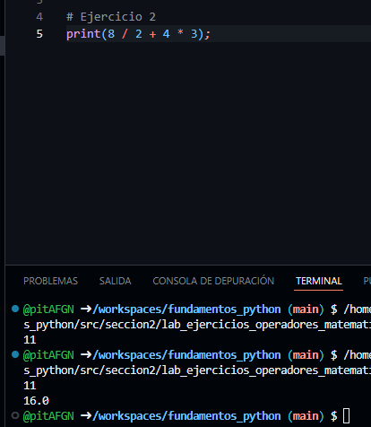

Pregunta: ¿Cuál es el resultado? ¿Por qué?
R:// Porque se le da la prioridad a la division, luego la multiplicacion y ya pues la suma en general es por eso que da ese resultado

Ejercicio 3

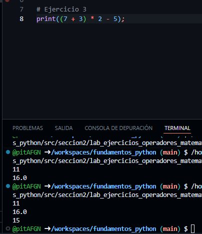

Pregunta: ¿Cuál es el resultado? ¿Por qué?
R:// Ahora se prioriza el parentesis y luego las demas operaciones no hay mejor manera de explicarlo creo

Ejercicio 4

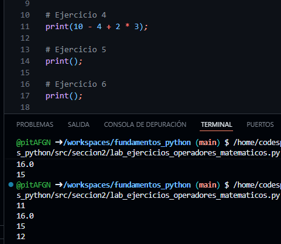

Pregunta: ¿Cuál es el resultado? ¿Por qué?
R:// Segun entiendo primero la multiplicacion como siempre y luego es de izquierda a derecha porque si es de derecha a izquiera podria causar algun error o algo asi habia entendido

Ejercicio 5

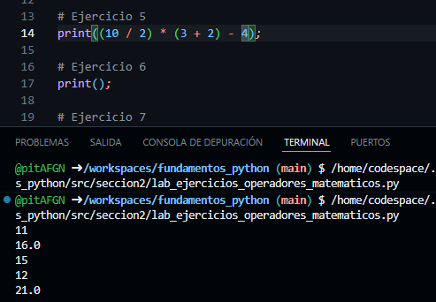

Pregunta: ¿Cuál es el resultado? ¿Por qué?
R:// Primero los parentesis de multiplicacion y suma, en ese mismo orden por que aca la jerarquia de orden sigue afectando y pues si y ya luego lo demas que este fuera del parentesis osea, los reusltados de los parentesis multiplicando y por ultimo la resta

Ejercicio 6

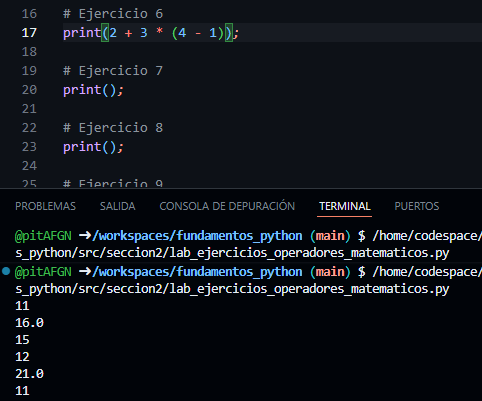

Pregunta: ¿Cuál es el resultado? ¿Por qué?
R:// Recordar, parentesis luego multiplicacion con el resultado de el parentesis y ya la suma y ya

Ejercicio 7

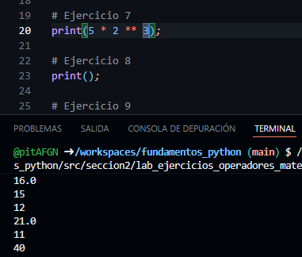

Pregunta: ¿Cuál es el resultado? ¿Por qué?
R:// Primero lo que esta potenciado (o el exponente pues) luego el resultado de la potencia por el 5 y pues ya ahi esta

Ejercicio 8

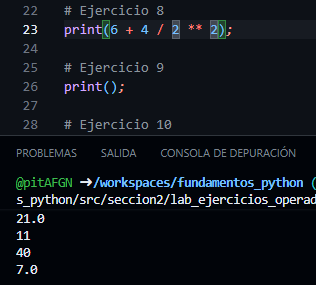

Pregunta: ¿Cuál es el resultado? ¿Por qué?
R:// Exactamente lo mismo primero lo que esta potenciado con exponente, luego se hace la division con el resultado del exponente y ya la suma al final, el mismo orden de jerarquia

Ejercicio 9

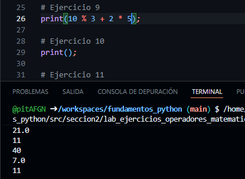

Pregunta: ¿Cuál es el resultado? ¿Por qué?
R:// En este caso primero es el modulo, luego la multiplicacion y por ultimo la suma usando el resultado del modulo por eso da ese resultado

Ejercicio 10

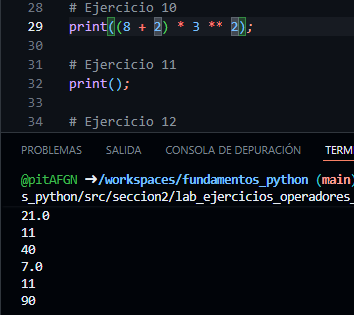

Pregunta: ¿Cuál es el resultado? ¿Por qué?
R:// Aca es lo mismo, parentesis luego la potencia y por ultimo la multiplicacion con el resultado del parentesis y la multiplicacion y listo por eso da ese resultado

Ejercicio 11

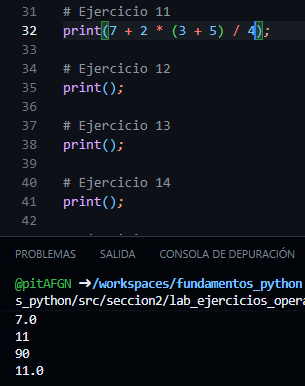

Pregunta: ¿Cuál es el resultado? ¿Por qué?
R:// Aca se hace de esta manera, primero se realiza el parentesis, luego la multiplicacion con el resultaod del parentesis, luego la division con el resultado de la multiplicacion y por ultimo la suma por eso da ese resultado

Ejercicio 12

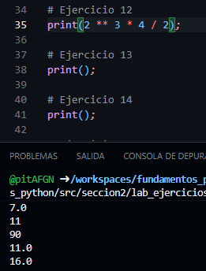

Pregunta: ¿Cuál es el resultado? ¿Por qué?
R:// Aca se reliza la potencia, luego con ese resultado la mutiplicacion y luego con ese resultado la division al final y ya, por eso da 16.0

Ejercicio 13

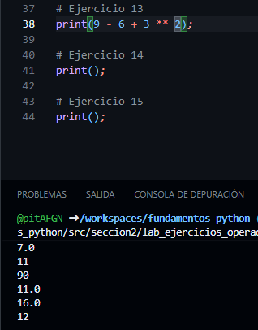

Pregunta: ¿Cuál es el resultado? ¿Por qué?
R:// Exactamente lo mismo aca, se realiza la potencia luego con ese resultado la resta y con ese resultado la suma y ya, TODO ES POR EL ORDEN DE JERARQUIA O DE PRIORIZACION QUE TIENE PYTHON!!

Ejercicio 14

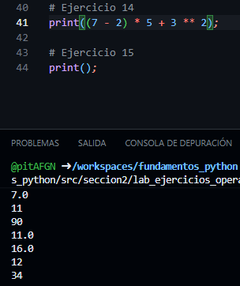

Pregunta: ¿Cuál es el resultado? ¿Por qué?
R:// el resultado es 34 PORQUE como siempre primero los parentesis, luego la potenciacion y luego con el resultado de el parentesis se hace la multiplicacion y con ese resultado se ahce la suma final que nos da 34

Ejercicio 15

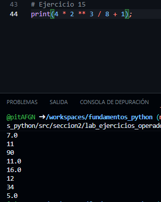

Pregunta: ¿Cuál es el resultado? ¿Por qué?
R:// aca se hace de esta manera, potencia, luego con ese resultado de la potencia se hace la multiplicacion y con ese resultado se hace la division para PORFIN sumar y darnos el resultado final de 15
