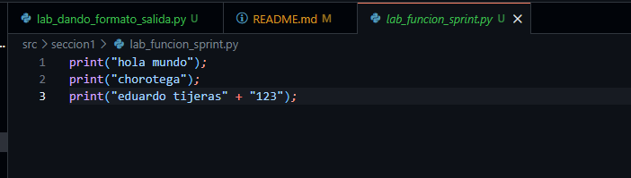
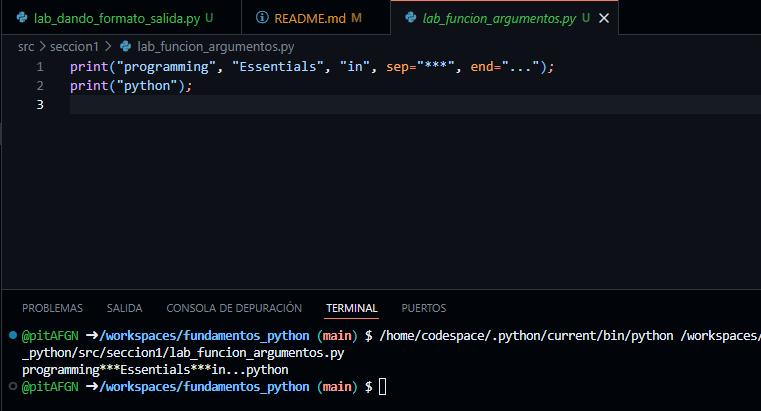
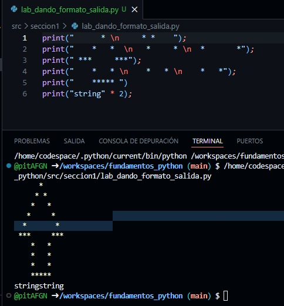
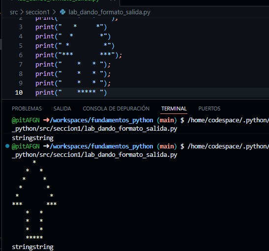
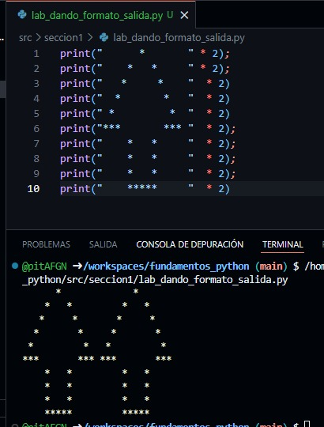
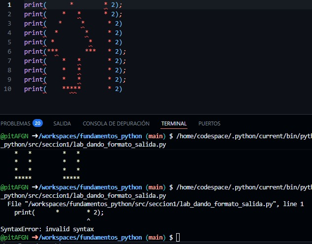
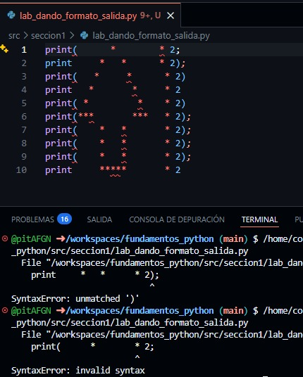
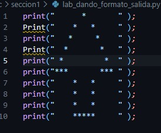
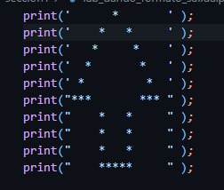

# fundamentos_python
navia actividad 1 trimestre 6

seccion 1:
lab 1 - "funcion sprint()"

Descripcion:En esta imagen vemos como se usa la funcion "sprint()" para imprimir un hola mundo en la consola y pues yo probe unas cosas extras que funcionan en otros lenguajes y pues es igual, tambien vemos abajo en la consola la ejecucion

lab 2 - "funcion sprint y sus argumentos"

Descripcion:En este laboratorio lo que vemos es que yo trato de replicar la misma estructura que nos pusieron en la actividad y para eso uso los argumentos "end=" y "sep=" para tratar de replicar segun crei que se hacia esa estructura de ejecucion, luego abajo se ve la ejecucion y se pudo segun yo creo, :)

lab 3 - "dando formato de salida"
remplazo con \n

Descripcion: En esta imagen trate de quitar la mayor cantidad de "prints()" usando el argumento "\n" dentro de mismos sprints tratando de replicar la misma estructura de flecha en la ejecucion

flecha mas grande

Descripcion: simplemente puse mas sprints() para hacer la flecha mas grande 

flechas dobles

Descripcion:Aca se muestra como usando un truco de replica explicado en la guia de notion, asi que lo use para replicar la flecha que salga una al lado del otro

eliminar comillas

¿es este el lugar donde realmente existe el error?
R:// en la iamgen se ve que el error que tira la consola, no es donde esta como tal el error, para mi esto demuestra que los errores no son del todo como se ven y que depende mucho de que conozcas el codigo para poder demostrar que esta fuera de lugar porque digamos error no me parece la mejor palabra ya que lo que puede parecer un error puede ser solo otro punto de vista del codigo.

parentesis eliminados

Descripcion: En esta captura lo que se ve es que yo quite algunos parentesis y asu ves las comillas tratando de ver que errores nos da en la terminal 

cambio de mayuscula

¿qué sucede ahora?
R:// lo que se ve en la imagen es que como tal nuestra maquina lo detecta como si fuera una funcion diferente, para dejarlo mas claro me refiero que hay mas funciones o acciones que se pueden derivar cambiando solo una mayuscula o minuscula, por eso nuestra maquina trata de encontrarle una logica a la palabra arrojando posibles resultados

cambio comillas simples

Descripcion: aca solo cambie algunas comillas de por comillas simples o apostrofos mirando que cambiaba y que podria sacar error y pues en la captura se ve que si nos causo algo de problemas pero creo que en parte es porque yo no remplaze todos con las mismas comillas o si directamente en python no se pueden usar comillas simples.
